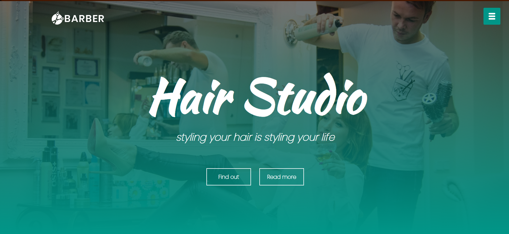
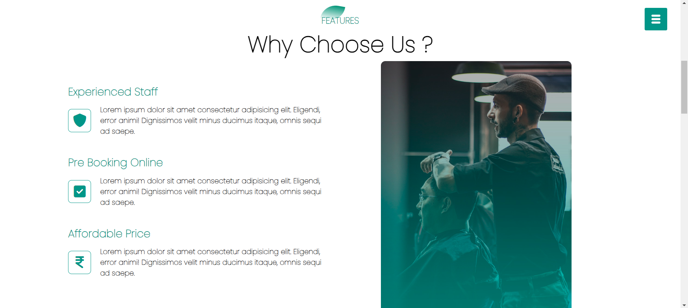
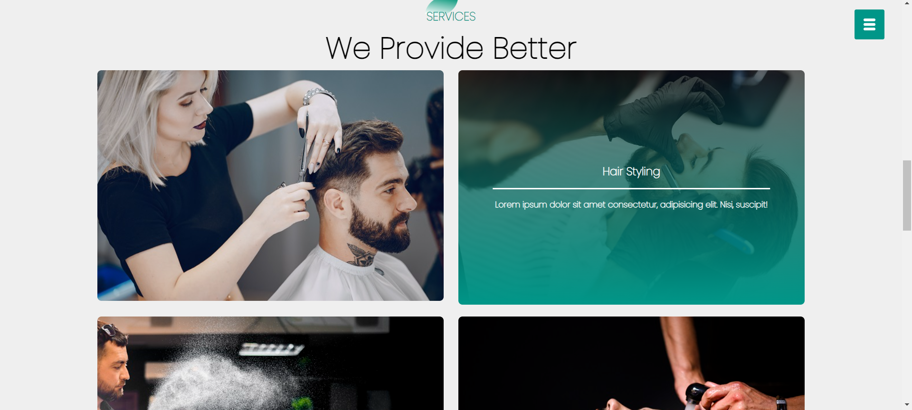
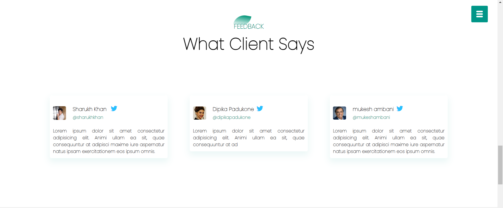
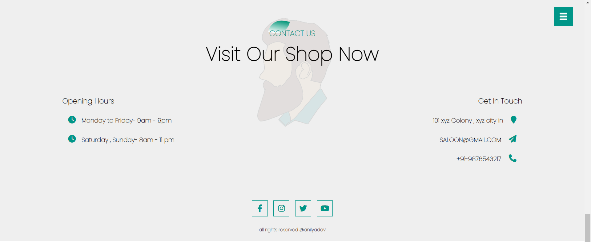

# Hair Saloon Web App

description: A dynamic hair salon web application built with HTML, CSS, and JavaScript, ensuring optimal display across all devices from small screens to desktops. Hosted on GitHub Pages, it made me solidify my understanding of how an end to end fully functional webapp is created.

## Deployment

Deployed link : https://yanil8068.github.io/hairsaloon/

## Tech Stack

HTML5, CSS3, JavaScript, GitHub Pages

## Screenshots

